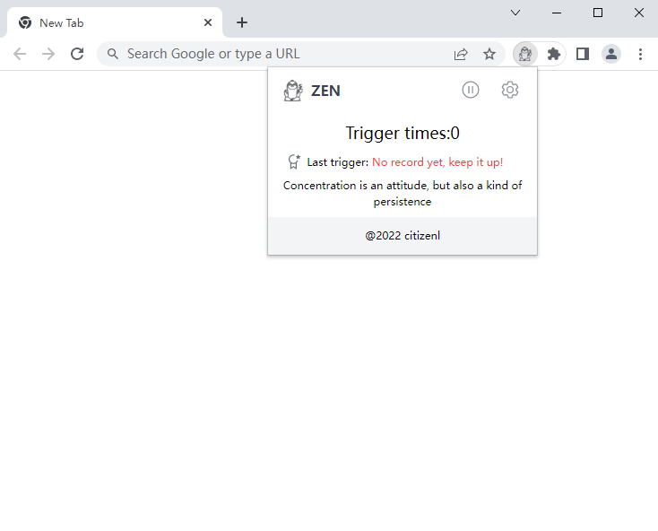
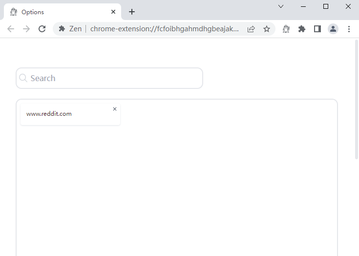
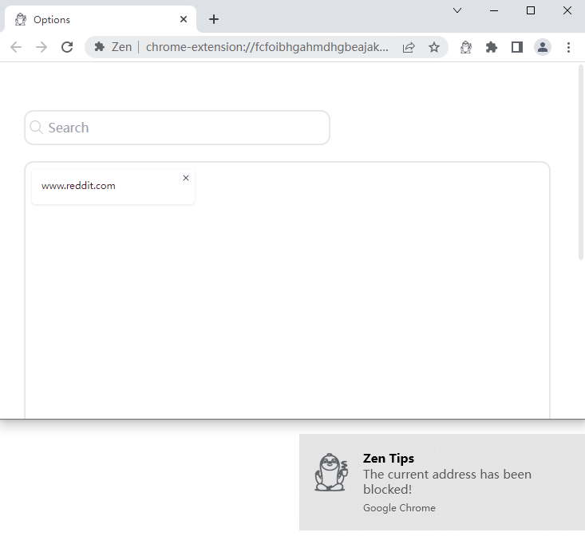

# ZEN 

## Stay focused in the browser
Extension will close the tab for you when you try to access a restricted URL

Popup 
 
Options Page 
 
When you try to access restricted URLs
 

### WebExtension Libraries

- [`webextension-polyfill`](https://github.com/mozilla/webextension-polyfill) - WebExtension browser API Polyfill with types
- [`webext-bridge`](https://github.com/antfu/webext-bridge) - effortlessly communication between contexts

### Vite Plugins

- [`unplugin-auto-import`](https://github.com/antfu/unplugin-auto-import) - Directly use `browser` and Vue Composition API without importing
- [`unplugin-vue-components`](https://github.com/antfu/vite-plugin-components) - components auto import
- [`unplugin-icons`](https://github.com/antfu/unplugin-icons) - icons as components
  - [Iconify](https://iconify.design) - use icons from any icon sets [🔍Icônes](https://icones.netlify.app/)
- [`vite-plugin-windicss`](https://github.com/antfu/vite-plugin-windicss) - WindiCSS support

### Vue Plugins

- [VueUse](https://github.com/antfu/vueuse) - collection of useful composition APIs

### UI Frameworks

- [Windi CSS](https://github.com/windicss/windicss) - next generation utility-first CSS framework

### Clone to local

If you prefer to do it manually with the cleaner git history

## Usage
Download the release file,then drag the unzipped folder into the plug-in page of the browser
[Go to download](https://github.com/citizenll/zen/releases) 

*VOICEOVER:You will be penalized when you try to suspend the plugin or delete the added URL :)*